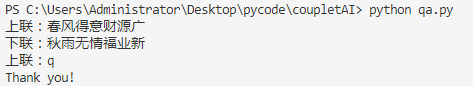

# CoupletAI
用 PyTorch 实现的自动对对联系统，支持多种模型。一般来讲，给定一句话生成另一句话是序列生成问题，本项目根据上下联字数相等的特点将其转化为序列标注问题，即用下联去标注上联。  
## Dependencies
* python 3.6+
* pytorch 1.2+
* flask (optional)
## Dataset
数据集包含70多万条对联数据(26MB)，下载请[点击这里](https://github.com/wb14123/couplet-dataset/releases/download/1.0/couplet.tar.gz)，或者[百度云](https://pan.baidu.com/s/1Zqnqq0VqZxv2c4jTNlZJGQ)(提取码: wude)。
## Usage
* 将下载到的数据集解压到当前目录（解压后的文件夹名称为`couplet`）
* 运行 `preprocess.py` 进行数据预处理
* 运行 `main.py [-m model type]` 进行训练
* 运行 `clidemo.py <-p model path>` 可在控制台进行AI对对联
* 运行 `webdemo.py <model path>` 可在Web端进行AI对对联

命令行参数的详细说明见文件内，你也可以在 `module/model.py` 中定义你自己的模型。
## Using Docker 
```docker pull wisedoge/coupletai```  

## Results Show
|   #          | 对联                               |
| ------------ | ---------------------------------- |
| 上联         | 放不开眼底乾坤，何必登斯楼把酒     |
| 下联         | 吞得尽胸中云梦，方许对古人言诗     |
| AI预测的下联 | 抛难在胸中日月，不然看此水凭诗     |
| 上联         | 春暮偶登楼，上下鱼龙，应惜满湖绿水 |
| 下联         | 酒醉休说梦，关山戎马，未如一枕黄梁 |
| AI预测的下联 | 秋寒常入酒，东来风水，更喜一岸红山 |
| 上联         | 一器成名只为茗                     |
| 下联         | 悦来客满是茶香                     |
| AI预测的下联 | 三年有梦不因诗                     |
| 上联         | 春夜灯花，几处笙歌腾朗月           |
| 下联         | 良宵美景，万家箫管乐丰年             |
| AI预测的下联 | 秋天月雨，一时风雨点清风           |
| 上联         | 一曲笙歌春似海                     |
| 下联         | 千门灯火夜如年                     |
| AI预测的下联 | 三年灯色梦如山                     |

## Screenshot
### 命令行运行

### 网页运行

### Web API

