# CoupletAI
基于CNN+Bi-LSTM+Attention 的自动对对联系统。一般来讲，给定一句话生成另一句话是序列生成问题，本项目根据上下联字数相等的特点将其转化为序列标注问题，即用下联去标注上联。
## Model Structure

## Dependencies
* python 3.5+
* pytorch 1.0+
* flask (optional)
## Dataset
数据集包含70多万条对联数据，下载请[点击这里](https://github.com/wb14123/couplet-dataset/releases/download/1.0/couplet.tar.gz)。
## Usage
* 将下载到的数据集解压到当前目录（解压后的文件夹名称为`couplet`）
* 运行 `train.py` 进行训练
* 运行 `qa.py` 可在控制台进行AI对对联
* 运行 `webdemo.py` 可在Web端进行AI对对联
## Using Pre-trained Model
[点击这里](https://github.com/WiseDoge/CoupletAI/releases/download/v1.0/cnn_lstm_att_20.pkl)下载预训练模型，并将模型放入 `config.ouput_dir` 所指定的文件夹（默认为`output`）中，再[点击这里](https://github.com/WiseDoge/CoupletAI/releases/download/v1.0/vocabs)下载词表，并将其放入`couplet`文件夹（若文件夹不存在则创建），然后即可运行 `qa.py` 或 `webdemo.py`。  
## Using Docker
1. Pull image  
```docker pull wisedoge/coupletai```  
2. Run  
```docker run -d -p 5000:5000 --name couplet_server wisedoge/coupletai python webdemo.py```  
3. Stop  
```docker container stop couplet_server```  

## Training in Google Colab
```https://colab.research.google.com/drive/1bqPiJZEiW-j4FcKKzE-WDV6frTsLCs1b```

## Results
下面展示一些结果  

|              | 对联                               |
| ------------ | ---------------------------------- |
| 上联         | 放不开眼底乾坤，何必登斯楼把酒     |
| 下联         | 吞得尽胸中云梦，方许对古人言诗     |
| AI预测的下联 | 抛难在胸中日月，不然看此水凭诗     |
| 上联         | 春暮偶登楼，上下鱼龙，应惜满湖绿水 |
| 下联         | 酒醉休说梦，关山戎马，未如一枕黄梁 |
| AI预测的下联 | 秋寒常入酒，东来风水，更喜一岸红山 |
| 上联         | 一器成名只为茗                     |
| 下联         | 悦来客满是茶香                     |
| AI预测的下联 | 三年有梦不因诗                     |
| 上联         | 春夜灯花，几处笙歌腾朗月           |
| 下联         | 良宵美景，万家箫管乐丰年             |
| AI预测的下联 | 秋天月雨，一时风雨点清风           |
| 上联         | 一曲笙歌春似海                     |
| 下联         | 千门灯火夜如年                     |
| AI预测的下联 | 三年灯色梦如山                     |

## Screenshot
### 命令行运行

### 网页运行

### Web API

## References
* Self-Attention 层的设计参考了 [pytorch-pretrained-BERT](https://github.com/huggingface/pytorch-pretrained-BERT)
* 一些结构的设计参考了 [NERs](https://github.com/WiseDoge/NERs)
